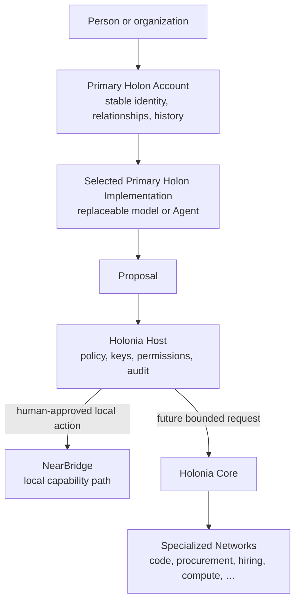
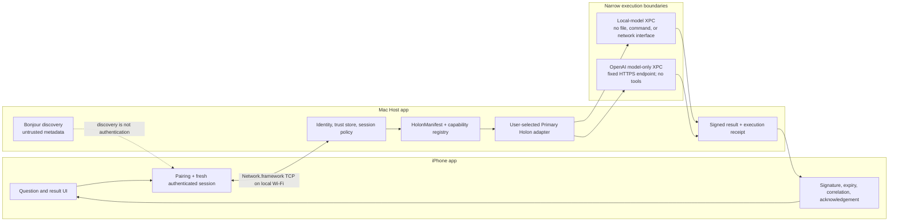

# Holonia · NearBridge

**NearBridge is the first working edge of Holonia:** a native iPhone-to-Mac
capability path where discovery stays untrusted, people approve identity, the
Mac Host controls which model may run, and the iPhone receives a signed,
correlated result.

[Watch the 2:50 physical-device demo](https://youtu.be/4s-6gypJUYA) ·
[Reviewer runbook](docs/build-week/reviewer-runbook.md) ·
[Validation evidence](docs/nearbridge/progress.md) ·
[中文介绍](README.zh-CN.md)

> **Experimental checkpoint:** one real iPhone/Mac pair has completed the
> Build Week happy path. NearBridge is not production-ready and does not claim
> payload encryption, concurrent multi-client routing, or arbitrary Agent
> execution.

## The Holonia vision

Holonia is a capability-discovery and work-connection network for people,
Agents, and organizations. It starts from one question:

> When a person or Agent lacks a capability, how can the request find a better
> Holon, establish trusted contact, delegate bounded work, and receive a
> verifiable result?

The motivating cases range from a phone reaching a stronger nearby model to a
non-technical user finding an Agent, expert, or organization able to complete
a task. Those cases share a request → discovery → trust → delegation → result
shape, but they do not share one trust domain. Holonia therefore separates a
small common Core from local capability paths and future specialized networks.

The governing principle is:

> **Holon proposes. Host enforces. Human authorizes.**

- A **Holon** is an addressable actor that can respond, act, and deliver.
- A **Primary Holon Account** owns stable identity, relationships, reputation,
  and history.
- A **Primary Holon Implementation** is replaceable software that serves that
  account.
- A **Holonia Host** owns identity keys, permissions, network access, policy,
  audit, and high-risk execution.
- **Holonia Core** will define the smallest reusable identity, request,
  response, propagation, and private-session semantics.
- **Specialized Networks** can later define domain-specific matching,
  acceptance, payment, reputation, and compliance rules.



The broader design remains intentionally unfrozen. See
[design decisions](docs/design-decisions.md), the
[roadmap](docs/roadmap.md), and [open questions](docs/open-questions.md).

## Problem and motivation

The phone in a person's hand is not always the best place to run the strongest
available model. Turning a personal Mac into a generic remote-execution server,
however, would give a nearby request far too much authority. Nearby discovery
also does not prove identity, consent, or what capability will execute.

The missing piece is not merely model access. It is a path that can find a
capability without confusing proximity with trust, let a person approve the
relationship, constrain what the remote capability can do, and return evidence
that the result belongs to the approved request and session.

## Why NearBridge comes first

NearBridge addresses that first local boundary. It lets an iPhone and a
user-launched Mac app:

1. discover one another on the same local network without treating discovery
   as trust;
2. compare and approve a six-digit pairing code on both devices;
3. establish a fresh authenticated session for signed, expiring, replay-aware
   messages;
4. complete a signed capability-contact workflow;
5. invoke one Host-registered inert-text capability through the Mac-selected
   Primary Holon adapter; and
6. return a signed typed result, acknowledgement, execution receipt, and
   sanitized diagnostics.

NearBridge is **not** the complete Holonia network. It does not implement open
P2P propagation, cross-principal reputation, payment, industry rules, or
arbitrary remote tools.

## 30-second demo flow

With both apps installed, Local Network permission granted, and the Mac's
allowlisted Primary Holon selected:

1. launch the iPhone and Mac apps on the same Wi-Fi;
2. select the discovered peer, choose **Pair**, and approve the same six-digit
   code on both devices;
3. on the iPhone, choose **Request Primary Holon contact** and complete the
   signed contact workflow;
4. enter an ordinary non-sensitive question and choose
   **Ask selected Mac Primary Holon**; and
5. observe the bounded answer on both devices together with a signed result,
   acknowledgement, and correlated execution evidence.

Under that visible flow, the request follows this path:

```text
iPhone question
→ authenticated signed NearBridge invocation
→ Mac Host policy + capability registry
→ user-selected OpenAI model-only Primary Holon
→ fixed GPT-5.6 Responses API request
→ bounded answer
→ signed typed result
→ iPhone validation, display, and acknowledgement
```

## Current NearBridge architecture



### Trust and execution boundaries

| Boundary | Current behavior |
| --- | --- |
| Discovery | Bonjour advertises minimal metadata; a discovered peer remains untrusted. |
| Pairing | Both devices explicitly approve the same short code; the Host manages stable keys and revocable trust records. |
| Session | Accepted messages are bound to sender, fresh session, signature, expiry, message ID, and correlation rules. |
| Capability | The iPhone names a stable inert-text capability, not a model, endpoint, path, command, or tool. |
| Provider selection | The Mac user selects one compile-time allowlisted Primary Holon implementation. |
| Local runner | A separate app-sandboxed XPC service receives a bounded request without file, workspace, command, Git, or dynamic-tool interfaces. |
| OpenAI runner | A separate network-client XPC service calls one fixed Responses API endpoint and model; it rejects redirects, uses `store: false`, and omits tools. |
| Credential | The OpenAI API key is entered only in the Mac app and stored in Mac Keychain; it is not sent to the iPhone, model input, logs, or diagnostic export. |
| Evidence | Prompt and answer bodies are excluded from sanitized export; readiness and correlated receipts remain visible. |

## OpenAI Build Week 2026

NearBridge was created during OpenAI Build Week; the first repository commit is
dated 2026-07-17. The demonstrated product path and the development workflow use
OpenAI technology in different ways:

| OpenAI component | Role in this project | Authority not granted |
| --- | --- | --- |
| **GPT-5.6 Sol** | The optional runtime model behind `OpenAIModelOnlyHolonAdapter`. The Mac makes a bounded Responses API request for the iPhone's inert-text question. | No files, workspace, shell, Git, device control, arbitrary URL, dynamic tools, or persistent Agent loop. |
| **Codex** | Engineering collaborator used to turn the written design brief into NB checkpoints; implement Swift discovery, pairing, authentication, workflows, manifests, XPC boundaries, tests, and reviewer UI; diagnose physical-device failures; and prepare runbooks and evidence. | Codex App/CLI credentials and tool permissions are not inherited by the NearBridge runtime. |

The incremental NB commits and tags preserve the implementation trail. The
Devpost submission uses the session ID returned after sharing the primary Codex
task through `/feedback`; that ID is submitted to the event rather than stored
as a project credential.

Implementation evidence:

- [`NearBridgeOpenAIRunner.swift`](NearBridge/NearBridgeShared/NearBridgeOpenAIRunner.swift)
  defines the bounded model-only request contract.
- [`OpenAIRunnerService.swift`](NearBridge/NearBridgeOpenAIRunner/OpenAIRunnerService.swift)
  implements the isolated network runner.
- [`NearBridgeHolonManifest.swift`](NearBridge/NearBridgeShared/NearBridgeHolonManifest.swift)
  defines versioned manifests and execution profiles.
- [`NearBridgeOpenAIRunnerTests.swift`](NearBridge/NearBridgeSharedTests/NearBridgeOpenAIRunnerTests.swift)
  covers endpoint, model, redirect, body, response, and error boundaries.
- [Submission narrative](docs/build-week/submission-draft.md) describes the
  complete Build Week use of GPT-5.6 and Codex.

## Quick start and tests

### Requirements

- macOS 14 or newer with Xcode;
- a physical iPhone running iOS 17 or newer;
- an Apple Development team for device installation;
- both apps active on the same Wi-Fi with Local Network permission; and
- optionally, the reviewer's own OpenAI API key for the real GPT-5.6 path.

### Shared tests

```bash
cd NearBridge
swift test
```

### Physical app path

1. Open `NearBridge/NearBridge.xcodeproj`.
2. Run `NearBridgeMac` on the Mac.
3. Run `NearBridgeIOS` on the physical iPhone.
4. Follow the [three-minute reviewer runbook](docs/build-week/reviewer-runbook.md).

No API key is committed. The deterministic and Apple adapters can exercise the
local trust and capability path without an OpenAI credential; the real GPT-5.6
network path requires a test key entered into the Mac app and stored in its
Keychain.

## Physical evidence

At the Build Week review checkpoint:

- 54/54 shared Swift tests passed;
- both macOS and generic iOS Device targets built;
- the Mac bundle embedded both XPC services; and
- one real iPhone/Mac pair showed discovery, explicit pairing,
  authentication, contact, a real model answer, signed delivery,
  acknowledgement, correlated receipts, and sanitized export.

See the [validation table](docs/nearbridge/progress.md),
[NB-9 results](docs/nearbridge/nb9-results.md), and
[Build Week P0/P1 results](docs/nearbridge/build-week-p0-p1-results.md).

## Current limitations

- NearBridge currently permits one active TCP/authenticated session and one
  in-flight Primary Holon invocation.
- It does not claim end-to-end payload encryption; the current demo accepts
  only ordinary non-sensitive text.
- Physical validation covers one iPhone/Mac pair. Concurrent multi-client,
  network-switching, longevity, simulator, and complete error matrices remain
  pending.
- Provider selection is limited to compile-time allowlisted adapters; signed
  third-party adapter admission is not implemented.
- No current capability receives files, workspace access, shell commands, Git,
  arbitrary URLs, dynamic tools, device control, or a persistent Agent loop.
- Open P2P propagation, reputation, payment, specialized-network rules, and
  answerer routing belong to later Holonia phases.

## Roadmap

The next platform checkpoint is signed third-party adapter admission, version
compatibility, and isolation verification. Later work may add:

- multi-client sessions, queues, routing, and explicit answerer selection;
- payload-encryption and recovery decisions;
- a controlled read-only workspace selector and file broker;
- typed, approval-gated tools inside recoverable worktrees; and
- eventually, durable tool-using Agents with budgets, cancellation, audit, and
  lifecycle recovery.

Open P2P propagation, reputation, payment, and specialized work networks belong
to the broader Holonia roadmap, not the current NearBridge checkpoint. The
[small code-task network plan](docs/code-network-plan.md) is a future design,
not an implemented feature.

## Documentation map

- [Holonia design decisions](docs/design-decisions.md)
- [Holonia roadmap](docs/roadmap.md)
- [NearBridge implementation plan](docs/nearbridge-plan.md)
- [NearBridge validation status](docs/nearbridge/progress.md)
- [Build Week reviewer runbook](docs/build-week/reviewer-runbook.md)
- [Build Week evaluation plan](docs/build-week/evaluation-plan.md)
- [Deferred validation and capability work](docs/nearbridge/deferred-validation-todo.md)
- [Open design questions](docs/open-questions.md)

## Licensing

The implementation under [`NearBridge/`](NearBridge/) is available under the
[MIT License](NearBridge/LICENSE). That license does **not** currently apply to
the broader Holonia concepts, design documents, roadmaps, media, or project
identity. See the repository [licensing notice](LICENSE.md) for the exact scope.
