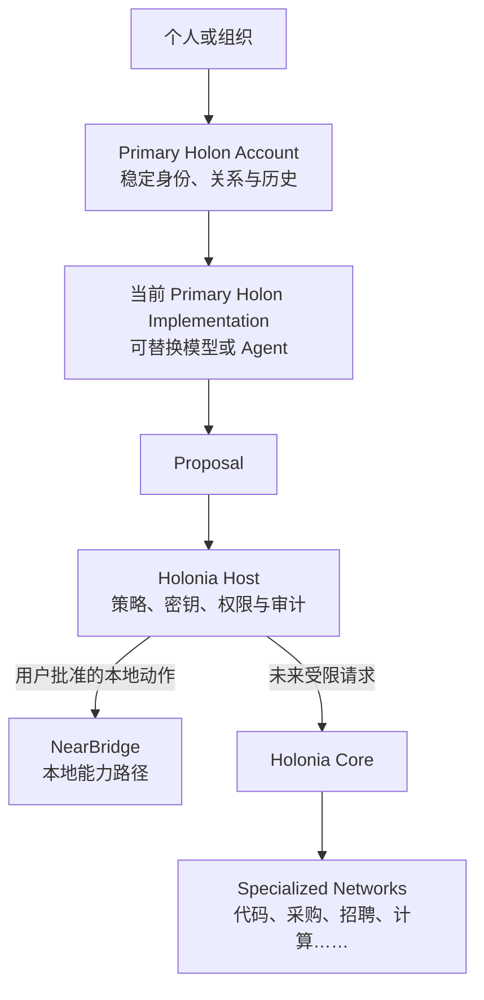
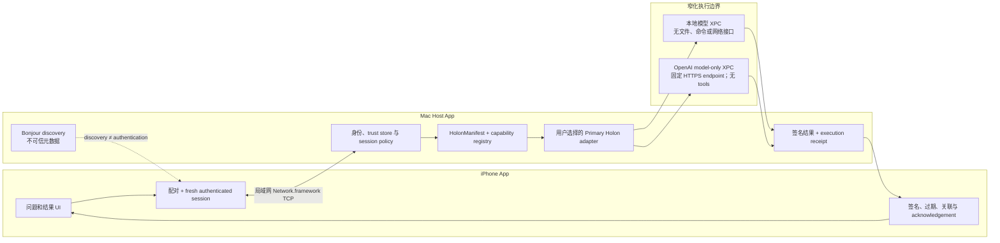

# Holonia · NearBridge

**NearBridge 是 Holonia 第一个真正运行的边缘实现：**它在 iPhone 与 Mac
之间建立一条本地能力路径——发现保持不可信、用户明确确认身份、Mac Host
决定哪个模型可以运行，iPhone 接收带签名和关联信息的结果。

[观看 2:50 真机演示](https://youtu.be/4s-6gypJUYA) ·
[评审运行手册](docs/build-week/reviewer-runbook.md) ·
[验证证据](docs/nearbridge/progress.md) ·
[English](README.md)

> **实验性 checkpoint：**一台真实 iPhone 与一台 Mac 已完成 Build Week
> 主路径。NearBridge 目前不是生产就绪版本，也不宣称 payload encryption、
> 并发多客户端路由或任意 Agent 执行。

## Holonia 愿景

Holonia 是一个面向人、Agent 与组织的能力发现和工作连接网络。它从一个
问题开始：

> 当一个人或 Agent 的当前能力不足时，如何找到更合适的 Holon、建立可信
> 联系、委托有边界的工作，并得到可验证的结果？

场景可以从手机调用附近更强的模型，一直延伸到非技术用户寻找能够完成
任务的 Agent、专家或组织。它们共享“需求 → 发现 → 信任 → 委托 → 结果”
的结构，但不处于同一个信任域。因此 Holonia 把最小 Core、本地能力路径和
未来的专业网络分开设计。

项目的核心原则是：

> **Holon proposes. Host enforces. Human authorizes.**

- **Holon**：可寻址、可回应、可行动和可交付的主体。
- **Primary Holon Account**：保存稳定身份、关系、信誉和历史。
- **Primary Holon Implementation**：为该账户服务、可以替换的软件实现。
- **Holonia Host**：掌握身份密钥、系统权限、网络、策略、审计和高风险执行。
- **Holonia Core**：未来跨专业网络复用的最小身份、请求、回应、传播和私密
  会话语义。
- **Specialized Network**：定义代码、采购、招聘、计算等领域的匹配、验收、
  支付、信誉与合规规则。



整体设计尚未冻结。详见[设计决策](docs/design-decisions.md)、
[总体路线](docs/roadmap.md)和[开放问题](docs/open-questions.md)。

## 问题与动机

用户手中的手机不一定适合运行当前最强模型，但把个人 Mac 直接变成通用
远程执行服务器又会给予附近请求过大的权限。局域网发现本身也不能证明
对方身份、用户同意或最终会运行什么能力。

缺少的不只是模型访问方式，而是一条完整路径：它需要发现能力但不把距离
误当成信任，让人明确批准关系，限制远端能力可以执行的事情，并提供证据，
说明返回结果确实属于被批准的请求和当前会话。

## 为什么先做 NearBridge

NearBridge 先解决这条本地边界。它让 iPhone 与用户主动启动的 Mac App：

1. 在同一局域网发现彼此，但不把发现当成信任；
2. 在两端比较并确认同一个六位配对码；
3. 建立 fresh authenticated session，交换带签名、过期和去重语义的消息；
4. 完成带签名的 capability contact 流程；
5. 通过 Mac 选择的 Primary Holon adapter 调用一个 Host 注册的纯文本能力；
6. 返回 signed typed result、acknowledgement、execution receipt 和净化诊断。

NearBridge **不是**完整 Holonia 网络。当前没有开放 P2P 传播、跨 Principal
信誉、支付、行业规则或任意远程工具。

## 30 秒演示流程

在两端 App 已安装、Local Network 已允许、Mac 已选择 allowlisted Primary
Holon 的前提下：

1. 在同一 Wi-Fi 启动 iPhone 与 Mac App；
2. 选择发现的 peer，点击 **Pair**，并在两端确认相同六位码；
3. 在 iPhone 点击 **Request Primary Holon contact**，完成带签名的联系流程；
4. 输入普通非敏感问题，点击 **Ask selected Mac Primary Holon**；
5. 在两端看到受限回答，以及 signed result、acknowledgement 和关联执行证据。

界面背后的请求路径是：

```text
iPhone 问题
→ authenticated signed NearBridge invocation
→ Mac Host policy + capability registry
→ 用户选择的 OpenAI model-only Primary Holon
→ 固定 GPT-5.6 Responses API 请求
→ 有界回答
→ signed typed result
→ iPhone 验证、显示并 acknowledgement
```

## 当前 NearBridge 架构



### 信任与执行边界

- Discovery 只广播最小信息，发现的 peer 仍是 untrusted。
- 配对要求两端明确确认同一短码，Host 管理稳定密钥和可撤销信任记录。
- 消息绑定 sender、fresh session、signature、expiry、message ID 和 correlation。
- iPhone 只能请求稳定的 inert-text capability，不能选择 provider、model、
  endpoint、路径、命令或 tool。
- Mac 用户从编译时 allowlist 中选择 Primary Holon Implementation。
- 本地和网络模型分别运行在独立 XPC service；接口不提供 workspace、文件、
  shell、Git、设备控制或动态 tools。
- OpenAI key 只在 Mac App 输入并保存到 Keychain，不进入 iPhone 消息、模型
  input、日志或诊断导出。

## Codex 与 GPT-5.6 如何使用

| OpenAI 组件 | 当前角色 | 未获得的权限 |
| --- | --- | --- |
| **GPT-5.6 Sol** | `OpenAIModelOnlyHolonAdapter` 后的可选运行时模型；Mac 为 iPhone 的纯文本问题发送有界 Responses API 请求。 | 文件、workspace、shell、Git、设备控制、任意 URL、动态 tools 和长期 Agent loop。 |
| **Codex** | Build Week 工程协作者；把设计 brief 拆成 NB checkpoints，完成 Swift 实现、XPC 边界、测试、真机故障诊断、评审 UI、runbook 和证据整理。 | NearBridge 运行时不会继承 Codex App/CLI 登录状态或工具权限。 |

Devpost 所需 Codex Session ID 来自在主要 Codex 任务中提交 `/feedback` 后
返回的 ID；它是活动提交信息，不是项目 credential。

## 快速开始与测试

### 共享测试

```bash
cd NearBridge
swift test
```

### 真机路径

1. 打开 `NearBridge/NearBridge.xcodeproj`。
2. 在 Mac 运行 `NearBridgeMac`。
3. 在真实 iPhone 运行 `NearBridgeIOS`。
4. 两端保持同一 Wi-Fi，并允许 Local Network。
5. 按[三分钟评审手册](docs/build-week/reviewer-runbook.md)完成配对、联系和问答。

仓库不包含 API key。deterministic 与 Apple adapter 不需要 OpenAI key；
真实 GPT-5.6 网络路径需要评审者在 Mac App 输入自己的测试 key，并由 Mac
Keychain 保存。

## 真机证据

Build Week checkpoint 已记录：

- 54/54 共享 Swift 测试通过；
- macOS 与通用 iOS Device 目标构建成功；
- Mac bundle 嵌入两个 XPC service；
- 一个真实 iPhone/Mac 设备对完成了发现、明确配对、认证、联系、真实模型
  回答、签名交付、acknowledgement、关联 receipt 和净化诊断导出。

详见[验证状态](docs/nearbridge/progress.md)、
[NB-9 结果](docs/nearbridge/nb9-results.md)和
[Build Week P0/P1 结果](docs/nearbridge/build-week-p0-p1-results.md)。

## 当前限制

- 当前只允许一个活动 TCP/认证 session 和一个在途 Primary Holon 调用。
- 暂不宣称端到端 payload encryption，演示只接受普通非敏感文本。
- 真机验证目前覆盖一组 iPhone/Mac；并发多客户端、网络切换、长期运行、
  simulator 和完整错误矩阵仍未完成。
- provider 只能来自编译时 allowlist；尚未实现签名第三方 adapter 准入。
- 当前能力无法访问文件、workspace、shell、Git、任意 URL、动态 tools、设备
  控制或长期 Agent loop。
- 开放 P2P、信誉、支付、专业网络规则和回答者路由属于后续 Holonia 阶段。

## 路线图

下一平台 checkpoint 是签名第三方 adapter 的准入、版本兼容和隔离验证。
更晚才会考虑多客户端、payload encryption、只读 workspace broker、
approval-gated tools 和具备预算、取消、审计与恢复的长期 Agent。

开放 P2P、信誉、支付和专业工作网络属于 Holonia 长期路线，而不是当前
NearBridge 缺失的同层功能。[小型代码任务网络计划](docs/code-network-plan.md)
是未来设计，不是已实现能力。

## 文档索引

- [Holonia 设计决策](docs/design-decisions.md)
- [Holonia 总体路线](docs/roadmap.md)
- [NearBridge 实现计划](docs/nearbridge-plan.md)
- [NearBridge 验证状态](docs/nearbridge/progress.md)
- [Build Week 评审手册](docs/build-week/reviewer-runbook.md)
- [Build Week evaluation plan](docs/build-week/evaluation-plan.md)
- [延后验证与能力工作](docs/nearbridge/deferred-validation-todo.md)
- [开放设计问题](docs/open-questions.md)

## 许可证

[`NearBridge/`](NearBridge/) 目录中的实现使用
[MIT License](NearBridge/LICENSE)。该 MIT License 当前**不覆盖**更广泛的
Holonia 概念、设计文档、路线、媒体或项目标识。准确范围见仓库
[许可证说明](LICENSE.md)。
