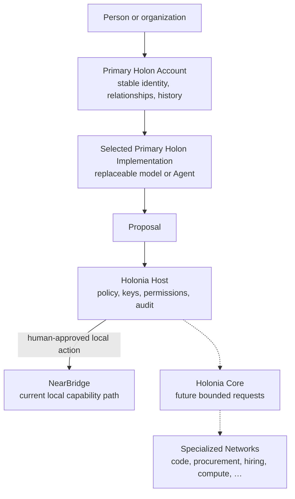

# Holonia Role and Authority Architecture

This page expands the role model behind NearBridge without implying that the
future Holonia network is already implemented. NearBridge is the current
runnable foundation; Holonia Core and Specialized Networks remain later work.

## Role model

## Interpretation

- A **Primary Holon Account** is the stable identity and relationship layer.
- A **Primary Holon Implementation** is replaceable software serving that
  account; selecting an implementation does not grant it Host authority.
- An implementation proposes work. The **Holonia Host** owns keys, policy,
  permissions, audit, and high-risk execution decisions.
- **NearBridge** is the implemented local path through which an explicitly
  approved, bounded capability can run and return correlated evidence.
- **Holonia Core** and **Specialized Networks** will later add propagation,
  private-session semantics, matching, acceptance, reputation, payment, and
  domain-specific rules.

The governing principle is unchanged:

> **Holon proposes. Host enforces. Human authorizes.**
